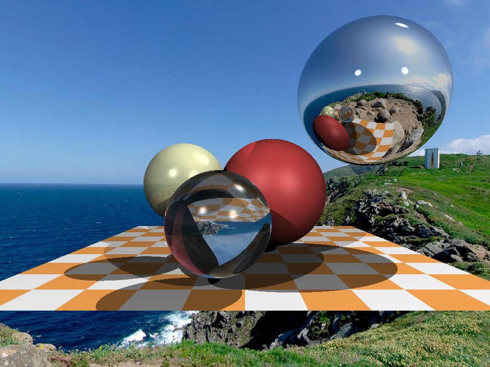

# GoRay
This is my fun implementation of the cool TinyRayTracer course here: https://github.com/ssloy/tinyraytracer

I used Golang for fun. This is the first code I've written in Go, so I'm likely to not be doing things the Go way. I'll try to improve that after finishing the implementation as well as while I'm implementing.

I'm currently finished with step 7, here's the output:

